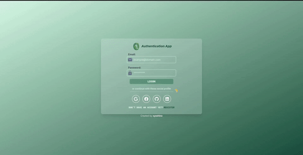
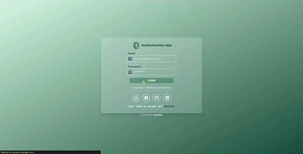
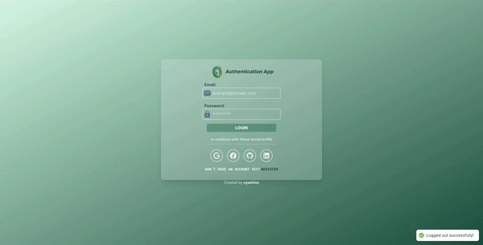
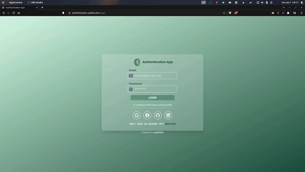
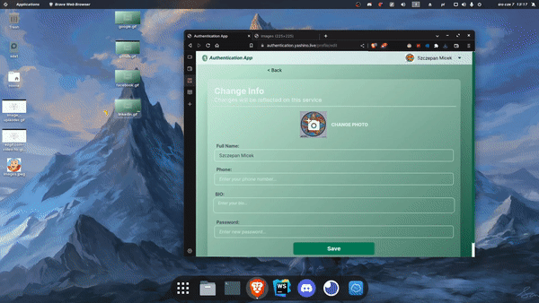

# Authentication App

The **Authentication App** is a simple application that facilitates user registration and login through multiple providers:

- **Facebook**
- **Google**
- **LinkedIn**
- **GitHub**

Moreover, users can log in using their **email** and **password**. They can also **change** their **avatar** (by uploading a new one or providing a URL) and **password**.

This is a full-stack application. The frontend is developed using **React** and the backend using **Nest.js**. Therefore, I have created two separate repositories:

- [Frontend Repository](https://github.com/xyashino/Authentication-FE.git)
- [Backend Repository](https://github.com/xyashino/Authentication-BE.git)

## You can find a live demo here: [DEMO](https://authentication.yashino.live/)

```
email: test@gmailcom
password: 12345678
```

The app is deployed on **[MyDevil.net](https://www.mydevil.net/)**.

## Authentication App - Frontend


# App Visualization:

## Login Using Providers

- **Facebook**
<div align="center">
    
</div>

- **Google**
<div align="center">
    
</div>

- **LinkedIn**
<div align="center">
    
</div>

- **GitHub**
<div align="center">
    
</div>

## Change Avatar

<div align="center">
    
</div>

## How to Run This App Locally

1. Clone the repository:

```
git clone https://github.com/xyashino/Authentication-FE.git
```

2. Install dependencies:

```
yarn
```

3. Run the application:

```
yarn dev
```
